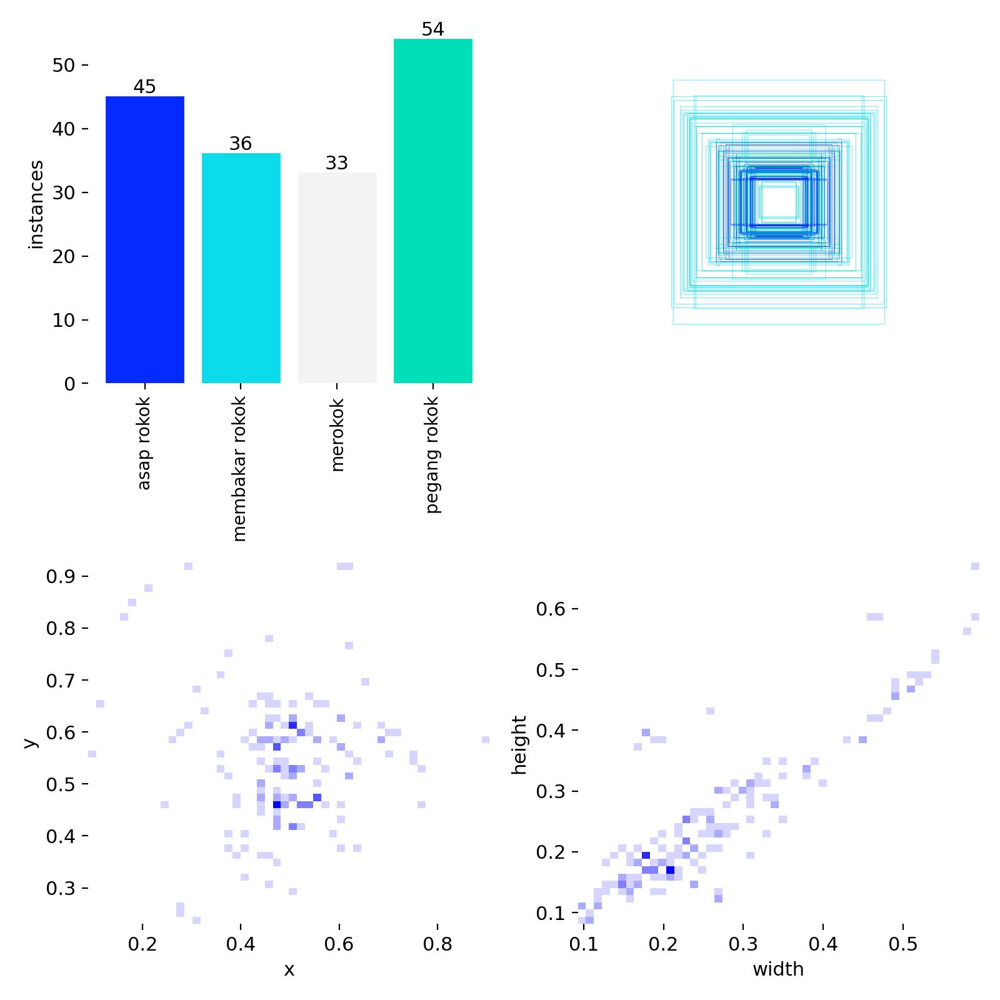
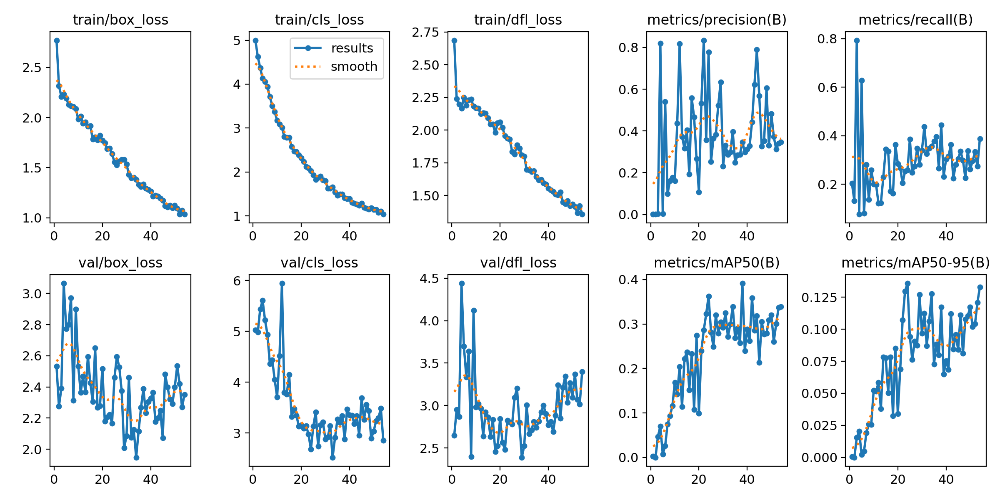
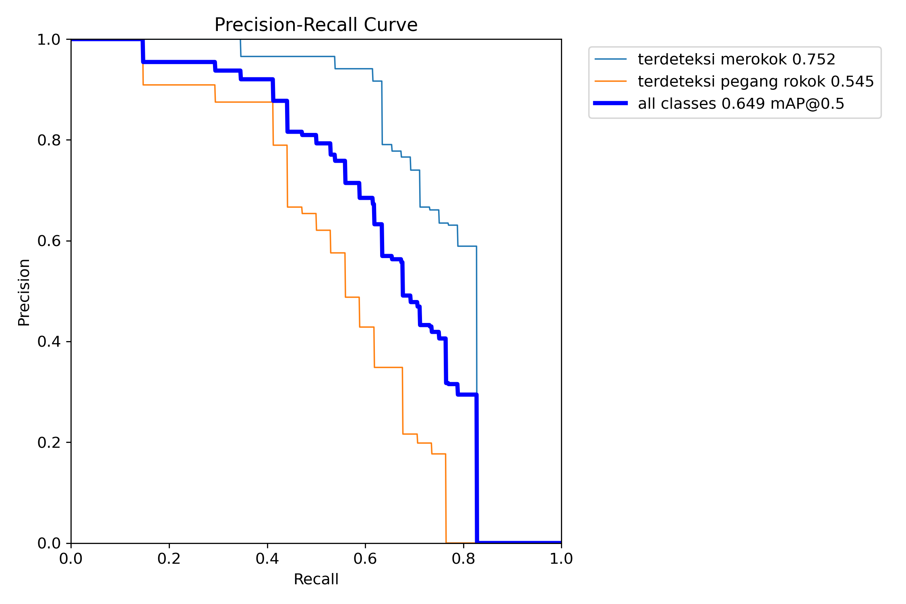
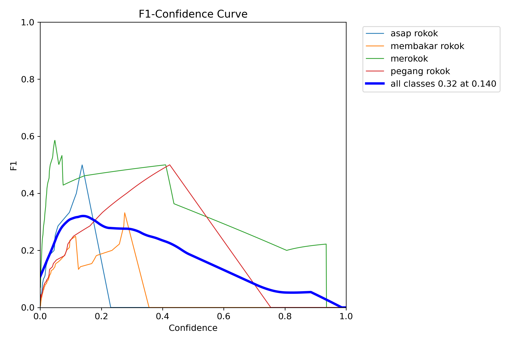
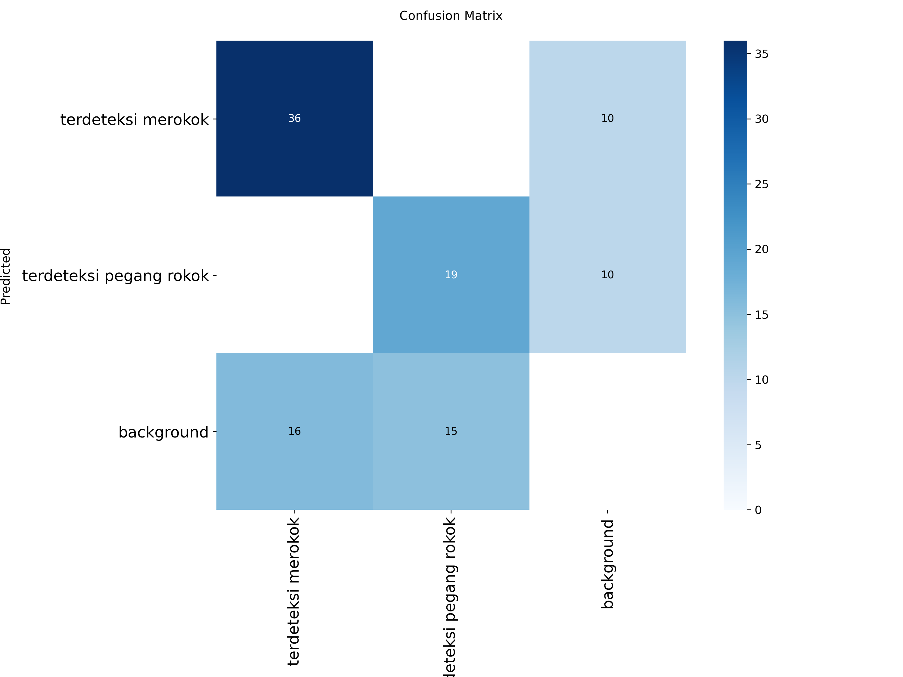
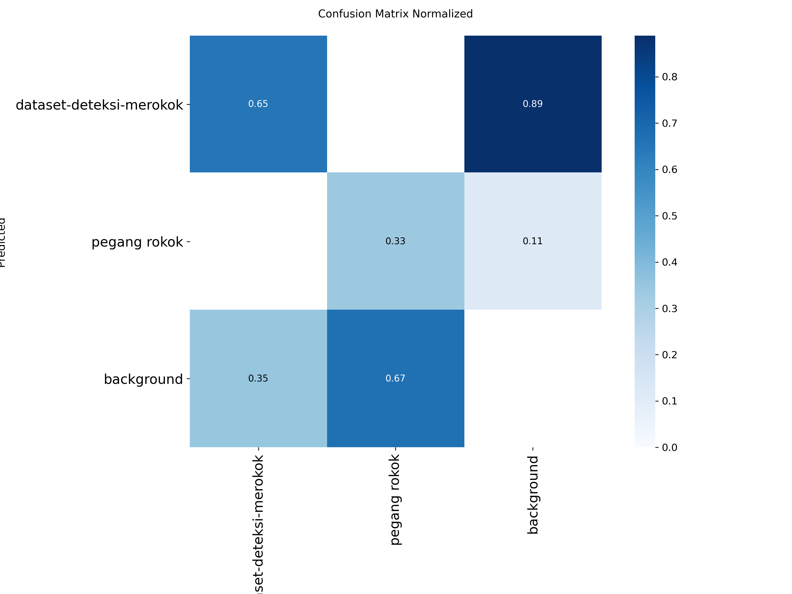

# BAB IV HASIL DAN PEMBAHASAN

## 4.1 Teknik Pengumpulan Data

### 4.1.1 Sumber Data

Pengumpulan data merupakan tahapan fundamental dalam pengembangan sistem deteksi aktivitas merokok berbasis *deep learning*. Dalam penelitian ini, data yang digunakan berupa citra (*image*) yang menggambarkan aktivitas seseorang yang sedang merokok maupun memegang rokok. Dataset dikumpulkan melalui platform **Roboflow Universe**, yang merupakan repositori publik untuk dataset *computer vision*. Dataset yang digunakan bersumber dari workspace **rizqhis-workspace** dengan nama proyek **dataset-deteksi-merokok-5fqjk versi 1**, yang dilisensikan di bawah **Creative Commons Attribution 4.0 (CC BY 4.0)**.

Sumber citra dalam dataset ini berasal dari berbagai koleksi foto publik, termasuk gambar-gambar dari platform **Pexels** dan kontribusi langsung melalui **WhatsApp**. Keragaman sumber data ini dimaksudkan untuk menjamin variasi dalam hal kondisi pencahayaan, sudut pengambilan gambar (*angle*), jarak objek terhadap kamera, serta latar belakang (*background*) yang berbeda-beda. Variasi tersebut sangat penting agar model yang dilatih mampu melakukan generalisasi dengan baik ketika diimplementasikan pada kondisi dunia nyata (*real-world*) yang beragam.

Seluruh citra yang digunakan memiliki resolusi yang bervariasi dan selanjutnya dinormalisasi ke ukuran **640×640 piksel** pada saat proses pelatihan (*training*) model. Normalisasi ukuran ini dilakukan agar seragam dengan arsitektur masukan (*input*) dari model YOLOv12 yang digunakan dalam penelitian.

### 4.1.2 Pembagian Dataset

Dataset yang telah dikumpulkan kemudian dibagi menjadi tiga subset utama sesuai dengan praktik standar dalam pengembangan model *machine learning*. Pembagian dataset dilakukan secara proporsional untuk memastikan keseimbangan antara kebutuhan pelatihan, validasi, dan pengujian model. Rincian pembagian dataset disajikan pada **Tabel 4.1** berikut.

**Tabel 4.1** Distribusi Pembagian Dataset

| Subset | Jumlah Citra | Jumlah Label | Persentase |
|--------|:------------:|:------------:|:----------:|
| *Training* | 846 | 846 | 87,4% |
| *Validation* | 81 | 81 | 8,4% |
| *Testing* | 40 | 40 | 4,1% |
| **Total** | **967** | **967** | **100%** |

Berdasarkan Tabel 4.1, proporsi terbesar dialokasikan untuk data *training* sebesar 87,4% (846 citra) yang digunakan untuk melatih model agar mampu mempelajari fitur-fitur visual dari aktivitas merokok. Subset *validation* sebesar 8,4% (81 citra) digunakan untuk mengevaluasi performa model selama proses pelatihan berlangsung guna mencegah *overfitting*. Sementara itu, subset *testing* sebesar 4,1% (40 citra) digunakan untuk mengukur performa akhir model pada data yang belum pernah dilihat sebelumnya.

### 4.1.3 Kelas Objek Deteksi

Sistem deteksi yang dikembangkan dalam penelitian ini dirancang untuk mengenali dua kelas objek yang berkaitan dengan aktivitas merokok. Pendefinisian dua kelas ini bertujuan untuk membedakan tingkat kepastian aktivitas merokok, sehingga sistem dapat memberikan respons yang proporsional. Kedua kelas tersebut dijelaskan pada **Tabel 4.2**.

**Tabel 4.2** Definisi Kelas Objek Deteksi

| ID Kelas | Nama Kelas | Deskripsi |
|:--------:|------------|-----------|
| 0 | *terdeteksi merokok* | Seseorang yang teridentifikasi sedang dalam aktivitas menghisap atau membakar rokok secara aktif |
| 1 | *terdeteksi pegang rokok* | Seseorang yang teridentifikasi sedang memegang rokok di tangan, namun belum tentu sedang menghisapnya |

Distribusi anotasi untuk masing-masing kelas pada setiap subset dataset disajikan pada **Tabel 4.3**.

**Tabel 4.3** Distribusi Anotasi Per Kelas

| Kelas | *Training* | *Validation* | *Testing* | **Total** |
|-------|:----------:|:------------:|:---------:|:---------:|
| Terdeteksi Merokok (0) | 543 | 52 | 33 | **628** |
| Terdeteksi Pegang Rokok (1) | 303 | 34 | 7 | **344** |
| **Total Anotasi** | **846** | **86** | **40** | **972** |

Berdasarkan Tabel 4.3, dapat diamati bahwa kelas *terdeteksi merokok* memiliki jumlah anotasi yang lebih dominan (64,6%) dibandingkan kelas *terdeteksi pegang rokok* (35,4%). Distribusi ini mencerminkan proporsi alami dari data yang dikumpulkan, di mana foto-foto aktivitas merokok aktif lebih banyak tersedia dibandingkan foto seseorang yang hanya memegang rokok. Ketidakseimbangan kelas (*class imbalance*) ini perlu diperhatikan dalam proses analisis performa model, karena dapat mempengaruhi kemampuan model dalam mendeteksi kelas minoritas.

## 4.2 Teknik Pelabelan Data

### 4.2.1 Format Anotasi

Pelabelan data (*data annotation*) merupakan proses pemberian informasi lokasi dan kategori objek pada setiap citra dalam dataset. Dalam penelitian ini, pelabelan dilakukan menggunakan platform **Roboflow** yang menyediakan antarmuka anotasi berbasis web dengan fitur kolaborasi dan manajemen versi dataset. Format anotasi yang digunakan adalah **YOLO format**, yang merupakan format standar untuk model-model dalam keluarga YOLO (*You Only Look Once*).

Setiap citra yang telah dianotasi memiliki file label berekstensi `.txt` dengan nama file yang identik dengan nama file citranya. Format penulisan anotasi pada setiap baris file label mengikuti konvensi berikut:

```
<class_id> <x_center> <y_center> <width> <height>
```

Keterangan:
- `class_id`: indeks kelas objek (0 untuk *terdeteksi merokok*, 1 untuk *terdeteksi pegang rokok*)
- `x_center`: koordinat x pusat *bounding box* dalam format ternormalisasi (0–1)
- `y_center`: koordinat y pusat *bounding box* dalam format ternormalisasi (0–1)
- `width`: lebar *bounding box* dalam format ternormalisasi (0–1)
- `height`: tinggi *bounding box* dalam format ternormalisasi (0–1)

Sebagai contoh, salah satu file label memiliki isi sebagai berikut:

```
0 0.490234375 0.44140625 0.1806640625 0.169921875
```

Baris di atas menunjukkan bahwa pada citra tersebut terdapat satu objek dengan kelas *terdeteksi merokok* (ID kelas 0), dengan pusat *bounding box* berada pada koordinat relatif (0.49, 0.44) dan ukuran *bounding box* sebesar 18,06% lebar gambar dan 16,99% tinggi gambar. Penggunaan format ternormalisasi memungkinkan anotasi bersifat *resolution-independent*, sehingga dapat diterapkan pada berbagai ukuran resolusi citra.

### 4.2.2 Proses Pelabelan

Proses pelabelan data dilakukan secara manual (*manual annotation*) melalui antarmuka web Roboflow. Setiap citra diperiksa secara visual oleh anotator, kemudian area yang mengandung objek relevan ditandai dengan *bounding box* persegi panjang yang mengelilingi objek secara *tight-fit*. Pedoman pelabelan yang diterapkan meliputi:

1. **Bounding box** harus mencakup seluruh area objek yang relevan tanpa terlalu banyak menyertakan area latar belakang.
2. Untuk kelas *terdeteksi merokok*, *bounding box* mencakup area wajah dan tangan yang sedang menghisap rokok.
3. Untuk kelas *terdeteksi pegang rokok*, *bounding box* mencakup area tangan yang sedang memegang rokok.
4. Satu citra dapat memiliki satu atau lebih anotasi apabila terdapat lebih dari satu objek yang terdeteksi dalam citra tersebut.

### 4.2.3 Augmentasi Data

Berdasarkan analisis terhadap penamaan file dalam dataset, teridentifikasi bahwa beberapa citra telah melalui proses augmentasi data yang dilakukan oleh Roboflow. Hal ini ditandai dengan adanya beberapa file yang memiliki nama dasar (*base name*) yang sama namun dengan *hash* yang berbeda, yang mengindikasikan bahwa citra-citra tersebut merupakan variasi augmentasi dari citra asli. Teknik augmentasi yang diterapkan bertujuan untuk meningkatkan keragaman data pelatihan dan membantu model dalam melakukan generalisasi yang lebih baik. Augmentasi yang umumnya diterapkan oleh Roboflow meliputi rotasi, *flipping*, perubahan kecerahan dan kontras, serta *cropping*.

### 4.2.4 Visualisasi Distribusi Dataset

Distribusi kelas dan karakteristik *bounding box* pada data pelatihan divisualisasikan pada **Gambar 4.1**. Visualisasi ini menunjukkan empat aspek penting dari dataset: (1) distribusi jumlah instansi per kelas, (2) distribusi spasial pusat *bounding box* pada citra, (3) sebaran posisi pusat objek pada sumbu x dan y, serta (4) distribusi rasio lebar dan tinggi *bounding box*.



**Gambar 4.1** Distribusi Dataset dan Karakteristik *Bounding Box*

Berdasarkan Gambar 4.1, terlihat bahwa kelas *terdeteksi merokok* memiliki 543 instansi, sedangkan kelas *terdeteksi pegang rokok* memiliki 303 instansi. Distribusi spasial pusat *bounding box* menunjukkan bahwa sebagian besar objek terkonsentrasi di area tengah citra, yang sesuai dengan kebiasaan pengambilan foto di mana subjek cenderung ditempatkan di bagian tengah frame. Distribusi ukuran *bounding box* menunjukkan bahwa sebagian besar objek memiliki ukuran relatif kecil hingga sedang terhadap keseluruhan citra.

## 4.3 Konfigurasi dan Proses Pelatihan Model

### 4.3.1 Arsitektur Model

Model yang digunakan dalam penelitian ini adalah **YOLOv12n** (*nano*), yaitu varian paling ringan dari arsitektur YOLOv12. Pemilihan varian *nano* didasarkan pada pertimbangan efisiensi komputasi, mengingat sistem dirancang untuk berjalan pada perangkat dengan spesifikasi terbatas tanpa dukungan GPU (*Graphics Processing Unit*) diskrit. Spesifikasi arsitektur model disajikan pada **Tabel 4.4**.

**Tabel 4.4** Spesifikasi Arsitektur Model YOLOv12n

| Parameter | Nilai |
|-----------|:-----:|
| Arsitektur | YOLOv12n (*nano*) |
| Jumlah Layer (fused) | 159 |
| Jumlah Parameter | 2.527.166 |
| Jumlah Gradien | 0 (saat inferensi) |
| GFLOPs | 5,8 |
| *Framework* | Ultralytics 8.4.48 |
| *Backend* | PyTorch 2.11.0+cpu |

### 4.3.2 Hyperparameter Pelatihan

Proses pelatihan dilakukan dengan konfigurasi *hyperparameter* yang telah ditentukan berdasarkan praktik terbaik (*best practice*) dalam pelatihan model YOLO. Rincian konfigurasi *hyperparameter* disajikan pada **Tabel 4.5**.

**Tabel 4.5** Konfigurasi *Hyperparameter* Pelatihan

| *Hyperparameter* | Nilai | Keterangan |
|-------------------|:-----:|------------|
| *Epochs* | 100 | Jumlah iterasi pelatihan keseluruhan dataset |
| *Image Size* | 640×640 | Resolusi input citra (piksel) |
| *Batch Size* | 16 | Jumlah citra per iterasi *forward-backward pass* |
| *Optimizer* | Auto (AdamW) | Algoritma optimisasi yang dipilih otomatis |
| *Learning Rate* (awal) | ~0.00163 | *Learning rate* awal |
| *Patience* | 30 | Jumlah epoch tanpa peningkatan sebelum *early stopping* |
| *IoU Threshold* | 0,7 | Ambang batas *Intersection over Union* |
| *Device* | CPU | AMD Ryzen 7 7445HS w/ Radeon 740M Graphics |
| *Pretrained* | Ya | Menggunakan *pretrained weights* dari COCO |
| *Close Mosaic* | 10 | Menonaktifkan augmentasi mosaik pada 10 epoch terakhir |
| *AMP* | Ya | *Automatic Mixed Precision* untuk efisiensi memori |

Proses pelatihan dijalankan pada perangkat berbasis CPU **AMD Ryzen 7 7445HS** tanpa akselerasi GPU. Total waktu pelatihan yang diperlukan adalah **25.460 detik** (~7 jam 4 menit) untuk menyelesaikan 100 epoch. Pelatihan menggunakan *pretrained weights* dari model YOLOv12n yang telah dilatih sebelumnya pada dataset **COCO** (*Common Objects in Context*), yang kemudian di-*fine-tune* pada dataset deteksi merokok.

### 4.3.3 Proses Pelatihan (*Training Process*)

Selama proses pelatihan, model mempelajari representasi fitur visual dari dua kelas objek secara iteratif. Pada setiap epoch, model memproses seluruh data pelatihan dalam batch berukuran 16 citra, melakukan *forward pass* untuk menghasilkan prediksi, menghitung *loss function*, dan melakukan *backward pass* untuk memperbarui *weights* model melalui algoritma *backpropagation*.

Tiga komponen *loss function* yang dioptimasi selama pelatihan meliputi:
1. **Box Loss** (*Localization Loss*): mengukur kesalahan prediksi posisi dan ukuran *bounding box* terhadap *ground truth*
2. **Classification Loss** (*Cls Loss*): mengukur kesalahan klasifikasi kelas objek
3. **Distribution Focal Loss** (*DFL Loss*): mengukur distribusi prediksi lokasi *bounding box*

Evolusi ketiga komponen *loss* selama proses pelatihan divisualisasikan pada **Gambar 4.2**.



**Gambar 4.2** Grafik *Training Loss* dan Metrik Evaluasi Selama Proses Pelatihan

Berdasarkan Gambar 4.2, dapat diamati bahwa:

1. **Train Box Loss** menurun secara konsisten dari ~2,41 pada epoch 1 menjadi ~0,69 pada epoch 100, menunjukkan bahwa model semakin akurat dalam memprediksi lokasi *bounding box*.
2. **Train Classification Loss** mengalami penurunan signifikan dari ~4,50 pada epoch 1 menjadi ~0,43 pada epoch 100, mengindikasikan peningkatan kemampuan model dalam mengklasifikasikan objek.
3. **Train DFL Loss** menurun dari ~2,40 menjadi ~1,09, menunjukkan peningkatan akurasi distribusi prediksi.
4. **Validation Loss** (box, cls, dfl) menunjukkan pola yang relatif stabil setelah epoch ke-20, mengindikasikan bahwa model tidak mengalami *overfitting* yang signifikan.

**Tabel 4.6** Perbandingan Nilai *Loss* Awal dan Akhir Pelatihan

| Komponen *Loss* | Epoch 1 | Epoch 100 | Penurunan (%) |
|------------------|:-------:|:---------:|:-------------:|
| Train Box Loss | 2,4084 | 0,6909 | 71,32% |
| Train Cls Loss | 4,5029 | 0,4271 | 90,51% |
| Train DFL Loss | 2,4026 | 1,0941 | 54,45% |
| Val Box Loss | 2,2593 | 2,0685 | 8,44% |
| Val Cls Loss | 4,8246 | 1,6750 | 65,28% |
| Val DFL Loss | 2,1387 | 2,6305 | -22,99% |

Berdasarkan Tabel 4.6, penurunan *loss* pada data pelatihan sangat signifikan, khususnya pada *Classification Loss* yang menurun hingga 90,51%. Pada sisi validasi, *box loss* dan *classification loss* juga menunjukkan penurunan, meskipun *DFL loss* validasi mengalami sedikit kenaikan yang mengindikasikan potensi *overfitting* ringan pada aspek distribusi lokasi *bounding box*.

## 4.4 Hasil Evaluasi Model

### 4.4.1 Metrik Evaluasi

Performa model dievaluasi menggunakan beberapa metrik standar dalam domain *object detection*, yaitu:

1. **Precision (P)**: rasio prediksi positif yang benar terhadap seluruh prediksi positif. Mengukur seberapa akurat prediksi model.
   $$Precision = \frac{TP}{TP + FP}$$

2. **Recall (R)**: rasio prediksi positif yang benar terhadap seluruh objek positif sesungguhnya. Mengukur kemampuan model mendeteksi seluruh objek.
   $$Recall = \frac{TP}{TP + FN}$$

3. **mAP50**: *mean Average Precision* pada *IoU threshold* 0,5. Rata-rata luas area di bawah kurva *Precision-Recall* untuk setiap kelas.

4. **mAP50-95**: *mean Average Precision* pada rentang *IoU threshold* 0,5 hingga 0,95 dengan interval 0,05. Metrik yang lebih ketat dan komprehensif.

5. **F1-Score**: *harmonic mean* dari Precision dan Recall, memberikan keseimbangan antara kedua metrik.
   $$F1 = 2 \times \frac{Precision \times Recall}{Precision + Recall}$$

### 4.4.2 Hasil Validasi Akhir

Setelah proses pelatihan selesai, dilakukan validasi akhir terhadap model pada keseluruhan data validasi. Hasil validasi akhir disajikan pada **Tabel 4.7**.

**Tabel 4.7** Hasil Evaluasi Model pada Data Validasi

| Kelas | *Images* | *Instances* | *Precision* | *Recall* | *mAP50* | *mAP50-95* |
|-------|:--------:|:-----------:|:-----------:|:--------:|:-------:|:-----------:|
| Seluruh Kelas | 81 | 86 | 0,837 | 0,538 | 0,649 | 0,292 |
| Terdeteksi Merokok | 48 | 52 | 0,898 | 0,635 | 0,752 | 0,347 |
| Terdeteksi Pegang Rokok | 33 | 34 | 0,775 | 0,441 | 0,545 | 0,236 |

Berdasarkan Tabel 4.7, dapat diinterpretasikan sebagai berikut:

1. **Performa keseluruhan** model mencapai *Precision* sebesar 0,837 dan *mAP50* sebesar 0,649. Nilai *Precision* yang tinggi menunjukkan bahwa ketika model mendeteksi suatu objek, prediksi tersebut memiliki tingkat kebenaran yang tinggi (83,7%). Namun, nilai *Recall* sebesar 0,538 menunjukkan bahwa model masih melewatkan sekitar 46,2% objek yang seharusnya terdeteksi.

2. **Kelas *terdeteksi merokok*** menunjukkan performa terbaik dengan *Precision* 0,898 dan *mAP50* 0,752. Hal ini menunjukkan bahwa model mampu mengenali aktivitas merokok aktif dengan tingkat akurasi yang tinggi.

3. **Kelas *terdeteksi pegang rokok*** memiliki performa lebih rendah dengan *mAP50* 0,545 dan *Recall* 0,441. Perbedaan performa ini dapat disebabkan oleh: (a) jumlah data pelatihan yang lebih sedikit untuk kelas ini, (b) variasi visual yang lebih beragam dalam cara seseorang memegang rokok, dan (c) fitur visual yang lebih halus (*subtle*) dibandingkan aktivitas merokok aktif.

4. **Kecepatan inferensi**: model mampu melakukan *preprocessing* dalam 2,0 ms, inferensi dalam 96,8 ms, dan *postprocessing* dalam 0,3 ms per citra. Total waktu pemrosesan sekitar 99,1 ms per citra, yang memungkinkan deteksi pada kecepatan ~10 FPS bahkan pada perangkat CPU.

### 4.4.3 Kurva Precision-Recall

Kurva *Precision-Recall* menunjukkan hubungan antara *Precision* dan *Recall* pada berbagai nilai *confidence threshold*. Area di bawah kurva (*Area Under Curve* / AUC) merepresentasikan nilai *Average Precision* (AP) untuk masing-masing kelas.



**Gambar 4.3** Kurva *Precision-Recall*

Berdasarkan Gambar 4.3, kelas *terdeteksi merokok* (garis biru muda) memiliki AP sebesar 0,752, yang berarti model memiliki kemampuan yang baik dalam mendeteksi aktivitas merokok aktif. Kelas *terdeteksi pegang rokok* (garis oranye) memiliki AP sebesar 0,545. Nilai mAP@0.5 keseluruhan (*all classes*, garis biru tua) adalah **0,649**.

### 4.4.4 Kurva F1-Confidence

Kurva F1-*Confidence* menunjukkan nilai F1-Score pada berbagai level *confidence threshold*, yang berguna untuk menentukan *threshold* optimal pada saat *deployment*.



**Gambar 4.4** Kurva F1-*Confidence*

Berdasarkan Gambar 4.4, nilai F1-Score optimal untuk seluruh kelas dicapai pada *confidence threshold* **0,463** dengan nilai F1 sebesar **0,65**. Kelas *terdeteksi merokok* mencapai F1-Score tertinggi sekitar 0,75 pada *confidence threshold* ~0,45, sedangkan kelas *terdeteksi pegang rokok* mencapai F1-Score maksimal sekitar 0,57. Informasi ini digunakan sebagai dasar penentuan *confidence threshold* pada implementasi sistem deteksi *real-time*.

### 4.4.5 Confusion Matrix

*Confusion Matrix* digunakan untuk mengevaluasi distribusi prediksi model terhadap *ground truth* pada data validasi. Matriks ini menunjukkan jumlah prediksi benar dan salah untuk setiap kombinasi kelas aktual dan kelas prediksi.



**Gambar 4.5** *Confusion Matrix*



**Gambar 4.6** *Confusion Matrix* Ternormalisasi

Berdasarkan Gambar 4.5 dan 4.6, analisis *Confusion Matrix* menghasilkan temuan sebagai berikut:

**Tabel 4.8** Analisis *Confusion Matrix*

| Prediksi \ Aktual | Terdeteksi Merokok | Terdeteksi Pegang Rokok | *Background* |
|--------------------|:------------------:|:-----------------------:|:------------:|
| Terdeteksi Merokok | **36** (69%) | 0 | 10 |
| Terdeteksi Pegang Rokok | 0 | **19** (56%) | 10 |
| *Background* (tidak terdeteksi) | 16 (31%) | 15 (44%) | - |

Interpretasi:
1. **Kelas *terdeteksi merokok***: model berhasil mendeteksi 36 dari 52 objek (69%), sementara 16 objek (31%) tidak terdeteksi (*false negative*). Tidak terdapat kesalahan klasifikasi antar kelas.
2. **Kelas *terdeteksi pegang rokok***: model berhasil mendeteksi 19 dari 34 objek (56%), sementara 15 objek (44%) tidak terdeteksi. Serupa dengan kelas sebelumnya, tidak terdapat kesalahan klasifikasi silang.
3. **False Positive dari *background***: model menghasilkan 10 prediksi *terdeteksi merokok* dan 10 prediksi *terdeteksi pegang rokok* pada area *background*, yang menunjukkan adanya *false positive* dari area yang seharusnya tidak mengandung objek target.
4. Tidak adanya kesalahan klasifikasi silang antara kedua kelas menunjukkan bahwa model mampu membedakan dengan baik antara aktivitas merokok aktif dan memegang rokok.

### 4.4.6 Progres Performa Selama Pelatihan

Untuk memberikan gambaran yang lebih komprehensif mengenai evolusi performa model, **Tabel 4.9** menyajikan metrik performa pada beberapa epoch kunci selama pelatihan.

**Tabel 4.9** Performa Model pada Epoch-Epoch Kunci

| Epoch | Precision | Recall | mAP50 | mAP50-95 | Train Box Loss | Train Cls Loss |
|:-----:|:---------:|:------:|:-----:|:--------:|:--------------:|:--------------:|
| 1 | 0,003 | 0,781 | 0,084 | 0,022 | 2,408 | 4,503 |
| 10 | 0,437 | 0,396 | 0,354 | 0,153 | 1,964 | 2,262 |
| 25 | 0,638 | 0,474 | 0,540 | 0,193 | 1,644 | 1,611 |
| 50 | 0,578 | 0,504 | 0,513 | 0,236 | 1,341 | 1,159 |
| 71 | 0,838 | 0,538 | **0,648** | **0,291** | 1,099 | 0,913 |
| 100 | 0,720 | 0,596 | 0,576 | 0,256 | 0,691 | 0,427 |

Berdasarkan Tabel 4.9, performa terbaik model (*best epoch*) dicapai pada **epoch ke-71** dengan mAP50 sebesar **0,648** dan mAP50-95 sebesar **0,291**. Setelah epoch ke-71, meskipun *training loss* terus menurun, performa pada data validasi mengalami fluktuasi yang menunjukkan gejala awal *overfitting*. Karena parameter *patience* diset pada nilai 30, model tetap melanjutkan pelatihan hingga epoch ke-100 tanpa terpicu *early stopping*.

## 4.5 Implementasi Sistem

### 4.5.1 Arsitektur Sistem

Sistem deteksi aktivitas merokok yang dikembangkan terdiri dari beberapa komponen utama yang saling terintegrasi membentuk sebuah *pipeline* deteksi *real-time*. Arsitektur sistem secara keseluruhan terdiri dari:

1. **Modul Akuisisi Video** (`video.py`): bertanggung jawab untuk menangkap frame video secara *real-time* dari berbagai sumber, termasuk webcam laptop, kamera IP (*IP Webcam* dari perangkat Android), atau file video. Modul ini mengimplementasikan arsitektur *multi-threaded* dengan komponen:
   - **FrameGrabber**: *thread* terpisah yang secara kontinu membaca frame terbaru dari stream video dan otomatis membuang frame lama untuk menghindari *lag*.
   - **InferenceWorker**: *thread* terpisah yang menjalankan inferensi YOLOv12 pada frame terbaru tanpa memblokir tampilan.

2. **Modul Alarm WhatsApp** (`alarm.py`): mengimplementasikan sistem notifikasi otomatis melalui WhatsApp menggunakan **WAHA** (*WhatsApp HTTP API*). Modul ini dilengkapi dengan mekanisme *event-based debouncing* yang mengelompokkan deteksi berturut-turut menjadi satu event, sehingga mengirimkan hanya 2 pesan per event (pesan awal dan ringkasan) alih-alih mengirim pesan untuk setiap frame deteksi. Fitur utamanya meliputi:
   - Sistem dua tingkat (*two-tier*): **suspect** (confidence 0,45–0,70) dan **confirm** (confidence ≥ 0,70)
   - *Temporal confirmation*: membutuhkan beberapa deteksi dalam jendela waktu tertentu sebelum memicu alarm
   - *Cooldown mechanism*: mencegah pengiriman pesan berulang (*spam*)

3. **Modul Bot WhatsApp** (`wa-bot/server.js`): server berbasis **Node.js** dan **whatsapp-web.js** yang berfungsi sebagai jembatan (*bridge*) pengiriman pesan WhatsApp. Server ini mengekspos *endpoint* REST API yang kompatibel dengan WAHA untuk pengiriman teks dan gambar.

4. **API Prediksi** (`api.py`): *RESTful API* berbasis **FastAPI** yang menyediakan *endpoint* untuk deteksi merokok pada gambar yang diunggah. Mendukung dua mode respons: JSON (*data detection*) dan visual (*image* dengan *bounding box*).

5. **Dashboard Monitoring** (`dashboard.py`): antarmuka berbasis **Streamlit** untuk monitoring dan analisis event deteksi secara *real-time*. Dashboard menampilkan statistik event, distribusi kelas, *confidence*, serta mendukung pelabelan *true positive*/*false positive* oleh pengguna.

### 4.5.2 Alur Kerja Sistem

Alur kerja sistem deteksi aktivitas merokok secara *end-to-end* adalah sebagai berikut:

1. Kamera (webcam/IP Webcam) menangkap video secara kontinu
2. **FrameGrabber** membaca frame terbaru dari stream video
3. **InferenceWorker** melakukan deteksi objek menggunakan model YOLOv12n pada setiap frame
4. Hasil deteksi ditampilkan secara *real-time* pada jendela OpenCV dengan *bounding box* dan informasi FPS
5. Jika terdeteksi aktivitas merokok dengan *confidence* mencukupi:
   - Sistem mengakumulasi deteksi dalam jendela waktu (*temporal confirmation*)
   - Event dikategorikan sebagai *suspect* atau *confirm* berdasarkan tingkat kepercayaan
   - Pesan alarm beserta snapshot dikirim ke WhatsApp melalui WAHA API
6. Event dicatat dalam file log JSONL untuk analisis lebih lanjut melalui dashboard

### 4.5.3 Hasil Pengujian Real-Time

Sistem telah diuji pada skenario *real-time* menggunakan kamera HP (*IP Webcam*) yang terhubung melalui jaringan lokal. Berdasarkan log event yang tercatat pada file `runs/events.jsonl`, **Tabel 4.10** menyajikan ringkasan event deteksi yang berhasil ditangkap oleh sistem.

**Tabel 4.10** Ringkasan Event Deteksi *Real-Time*

| Event ID | Durasi (detik) | Level | Peak Class | Peak Conf. | Frame | WA Sent |
|----------|:--------------:|:-----:|------------|:----------:|:-----:|:-------:|
| d86dd776adad | 95,88 | Confirm | Terdeteksi Pegang Rokok | 89,33% | 366 | Ya |
| 71942e4f3df5 | 76,90 | Confirm | Terdeteksi Pegang Rokok | 91,65% | 100 | Ya |
| 75d189856a2d | 23,51 | Confirm | Terdeteksi Merokok | 81,39% | 55 | Ya |
| e00d791d5feb | 0,65 | Suspect | Terdeteksi Merokok | 51,93% | 10 | Tidak |

Berdasarkan Tabel 4.10:
- Sistem berhasil mendeteksi dan mengkategorikan 4 event deteksi, di mana 3 event dikategorikan sebagai **confirm** dan 1 event sebagai **suspect**.
- Event dengan level *confirm* secara otomatis mengirimkan notifikasi WhatsApp beserta snapshot gambar, sedangkan event *suspect* tidak mengirim notifikasi karena *confidence* di bawah ambang batas *confirm*.
- *Peak confidence* tertinggi mencapai **91,65%** pada event deteksi pegang rokok, menunjukkan bahwa model mampu memberikan prediksi dengan tingkat keyakinan tinggi pada kondisi nyata.
- Mekanisme *event-based debouncing* berhasil mengurangi jumlah notifikasi secara signifikan. Sebagai contoh, event `d86dd776adad` memiliki 366 frame deteksi namun hanya menghasilkan 2 pesan WhatsApp (start + summary), dibandingkan 366 pesan jika tanpa mekanisme debouncing.

## 4.6 Pengujian Sistem

### 4.6.1 Teknik Pengujian

Dalam penelitian ini, teknik pengujian yang digunakan adalah kombinasi dari **pengujian *Black-Box Testing*** dan **pengujian performa model (*Model Performance Testing*)**. Pemilihan kedua teknik ini didasarkan pada pertimbangan berikut:

1. ***Black-Box Testing*** dipilih karena sistem yang dikembangkan memiliki antarmuka pengguna dan fungsionalitas yang perlu divalidasi dari perspektif pengguna akhir (*end-user*). Pengujian ini berfokus pada **apa yang dilakukan sistem** tanpa memperhatikan detail internal implementasi, sehingga sesuai untuk memvalidasi apakah sistem memenuhi kebutuhan fungsional yang telah didefinisikan.

2. **Pengujian Performa Model** dipilih karena inti dari sistem ini adalah model *deep learning* YOLOv12 yang perlu dievaluasi secara kuantitatif menggunakan metrik-metrik standar *object detection* (Precision, Recall, mAP). Pengujian ini telah dipaparkan pada Subbab 4.4.

### 4.6.2 Pengujian Black-Box

Pengujian *Black-Box* dilakukan untuk memvalidasi fungsionalitas sistem secara keseluruhan berdasarkan skenario penggunaan (*use case*) yang telah didefinisikan. Pengujian dilakukan dengan metode **equivalence partitioning** dan **boundary value analysis** untuk memastikan sistem memberikan respons yang benar pada berbagai kondisi input. Hasil pengujian *Black-Box* disajikan pada **Tabel 4.11**.

**Tabel 4.11** Hasil Pengujian *Black-Box* – Modul Deteksi Video (*video.py*)

| No. | Skenario Pengujian | Input | Output yang Diharapkan | Output Aktual | Status |
|:---:|---------------------|-------|------------------------|---------------|:------:|
| 1 | Membuka webcam laptop sebagai sumber video | `--source 0` | Jendela video tampil dengan overlay deteksi | Jendela video tampil dengan overlay FPS, jumlah deteksi, dan *bounding box* | ✅ Berhasil |
| 2 | Membuka IP Webcam dari perangkat HP Android | `--source http://192.168.1.69:8080/video` | Stream video dari HP tampil dan terproses | Stream video terbuka, deteksi berjalan *real-time* | ✅ Berhasil |
| 3 | Mendeteksi objek merokok pada video *real-time* | Video dengan subjek merokok | Bounding box dengan label dan confidence muncul | Bounding box muncul dengan label "terdeteksi merokok" dan nilai confidence | ✅ Berhasil |
| 4 | Mendeteksi objek pegang rokok pada video *real-time* | Video dengan subjek memegang rokok | Bounding box dengan label "terdeteksi pegang rokok" muncul | Bounding box muncul dengan label dan confidence yang sesuai | ✅ Berhasil |
| 5 | Menghentikan deteksi dengan tombol 'q' | Menekan tombol 'q' pada jendela video | Proses berhenti dan window tertutup | Proses deteksi berhenti, semua resource dilepas | ✅ Berhasil |
| 6 | Sumber video tidak valid | `--source invalid_path.mp4` | Pesan error yang informatif | Error: "File tidak ditemukan: invalid_path.mp4" | ✅ Berhasil |

**Tabel 4.12** Hasil Pengujian *Black-Box* – Modul Alarm WhatsApp (*alarm.py*)

| No. | Skenario Pengujian | Input | Output yang Diharapkan | Output Aktual | Status |
|:---:|---------------------|-------|------------------------|---------------|:------:|
| 1 | Alarm terkirim saat deteksi dengan confidence tinggi (≥70%) | Deteksi merokok dengan conf. 81,39% | Pesan WhatsApp terkirim ke penerima | Pesan alarm beserta snapshot terkirim ke nomor WA penerima | ✅ Berhasil |
| 2 | Alarm TIDAK terkirim saat confidence rendah (level suspect) | Deteksi merokok dengan conf. 51,93% | Tidak ada pesan WhatsApp terkirim | wa_sent: false, tidak ada pesan dikirim | ✅ Berhasil |
| 3 | Event debouncing: banyak frame deteksi hanya menghasilkan 2 pesan | 366 frame deteksi dalam 1 event | Hanya 2 pesan (start + summary) | 2 pesan terkirim meskipun 366 frame terdeteksi | ✅ Berhasil |
| 4 | Event summary terkirim setelah event berakhir | Deteksi berhenti setelah beberapa waktu | Pesan ringkasan event terkirim | Pesan summary dengan durasi dan frame count terkirim | ✅ Berhasil |

**Tabel 4.13** Hasil Pengujian *Black-Box* – Modul API Prediksi (*api.py*)

| No. | Skenario Pengujian | Input | Output yang Diharapkan | Output Aktual | Status |
|:---:|---------------------|-------|------------------------|---------------|:------:|
| 1 | Upload gambar valid (JPG) untuk prediksi | File gambar .jpg melalui endpoint `/predict` | JSON dengan daftar deteksi | Respons JSON berisi filename, image_size, detections | ✅ Berhasil |
| 2 | Upload gambar dengan visualisasi | File gambar melalui endpoint `/predict/visual` | Gambar PNG dengan bounding box | Gambar PNG dikembalikan dengan bounding box tergambar | ✅ Berhasil |
| 3 | Upload file dengan tipe tidak didukung | File .txt melalui endpoint `/predict` | HTTP 415 Unsupported Media Type | Error 415: "Tipe file tidak didukung" | ✅ Berhasil |
| 4 | Upload file melebihi batas ukuran (>10 MB) | File gambar >10 MB | HTTP 413 Payload Too Large | Error 413: "File terlalu besar" | ✅ Berhasil |
| 5 | Nilai confidence di luar rentang (>1.0) | conf=1.5 | HTTP 400 Bad Request | Error 400: "conf harus antara 0.0 - 1.0" | ✅ Berhasil |
| 6 | Health check endpoint | GET `/health` | JSON status ok | {"status": "ok", "model_loaded": true} | ✅ Berhasil |

**Tabel 4.14** Hasil Pengujian *Black-Box* – Dashboard Monitoring (*dashboard.py*)

| No. | Skenario Pengujian | Input | Output yang Diharapkan | Output Aktual | Status |
|:---:|---------------------|-------|------------------------|---------------|:------:|
| 1 | Menampilkan daftar event deteksi | Mengakses halaman dashboard | Daftar event dengan detail informasi | Daftar event tampil dengan level, kelas, confidence, durasi | ✅ Berhasil |
| 2 | Filter event berdasarkan rentang tanggal | Memilih rentang tanggal pada sidebar | Hanya event dalam rentang yang tampil | Event terfilter sesuai tanggal yang dipilih | ✅ Berhasil |
| 3 | Filter event berdasarkan level (confirm/suspect) | Memilih level pada sidebar | Hanya event dengan level terpilih yang tampil | Event terfilter berdasarkan level | ✅ Berhasil |
| 4 | Menampilkan snapshot event | Klik expand pada event | Gambar snapshot tampil | Snapshot event tampil dari folder `runs/alarm/` | ✅ Berhasil |
| 5 | Melabeli event sebagai False Positive | Klik tombol "❌ False Positive" | Label tersimpan di `labels.jsonl` | Label false positive tersimpan dan tampilan diperbarui | ✅ Berhasil |
| 6 | Melabeli event sebagai True Positive | Klik tombol "✅ True Positive" | Label tersimpan di `labels.jsonl` | Label true positive tersimpan dan tampilan diperbarui | ✅ Berhasil |
| 7 | Ekspor data ke CSV | Klik tombol "📥 Download CSV" | File CSV terunduh | File CSV berisi event yang terfilter berhasil diunduh | ✅ Berhasil |
| 8 | Menampilkan metrik reduksi notifikasi | Data event tersedia | Statistik reduksi notifikasi tampil | Ditampilkan jumlah frame, event, pesan WA, dan persentase reduksi | ✅ Berhasil |

### 4.6.3 Rekapitulasi Hasil Pengujian *Black-Box*

**Tabel 4.15** Rekapitulasi Pengujian *Black-Box*

| Modul | Jumlah Skenario | Berhasil | Gagal | Persentase Keberhasilan |
|-------|:---------------:|:--------:|:-----:|:-----------------------:|
| Deteksi Video | 6 | 6 | 0 | 100% |
| Alarm WhatsApp | 4 | 4 | 0 | 100% |
| API Prediksi | 6 | 6 | 0 | 100% |
| Dashboard Monitoring | 8 | 8 | 0 | 100% |
| **Total** | **24** | **24** | **0** | **100%** |

Berdasarkan Tabel 4.15, seluruh 24 skenario pengujian *Black-Box* berhasil dilaksanakan dengan tingkat keberhasilan **100%**. Hal ini menunjukkan bahwa seluruh fungsionalitas sistem telah berjalan sesuai dengan spesifikasi kebutuhan yang telah ditetapkan.

## 4.7 Pembahasan

### 4.7.1 Analisis Performa Model

Berdasarkan hasil evaluasi yang telah dipaparkan, model YOLOv12n yang dilatih pada dataset deteksi merokok menunjukkan performa yang cukup baik dengan beberapa catatan penting:

1. **Precision tinggi (83,7%)** menunjukkan bahwa model memiliki tingkat kepercayaan yang tinggi dalam memberikan prediksi. Ketika model mendeteksi suatu objek sebagai aktivitas merokok, kemungkinan besar prediksi tersebut benar. Hal ini sangat penting dalam konteks sistem alarm, karena meminimalkan *false alarm* yang dapat mengganggu pengguna.

2. **Recall moderat (53,8%)** mengindikasikan bahwa model masih melewatkan sejumlah objek. Dalam konteks sistem keamanan, *recall* yang lebih tinggi akan lebih ideal. Namun, karena sistem ini beroperasi secara kontinu pada video *real-time*, objek yang tidak terdeteksi pada satu frame masih memiliki kesempatan untuk terdeteksi pada frame-frame berikutnya, sehingga efek *recall* yang moderat dapat dikompensasi oleh mekanisme *temporal confirmation*.

3. **Perbedaan performa antar kelas** mengonfirmasi bahwa deteksi aktivitas merokok aktif (mAP50: 0,752) lebih mudah dikenali oleh model dibandingkan deteksi memegang rokok (mAP50: 0,545). Hal ini konsisten dengan karakteristik visual dari kedua aktivitas tersebut, di mana merokok aktif memiliki fitur yang lebih distinktif (posisi rokok di mulut, asap, dsb.).

### 4.7.2 Efektivitas Sistem Alarm

Mekanisme *event-based debouncing* yang diimplementasikan terbukti efektif dalam mengurangi volume notifikasi WhatsApp. Berdasarkan data event yang tercatat, sistem berhasil mengkonversi ratusan frame deteksi menjadi hanya beberapa pesan notifikasi yang ringkas dan informatif. Sebagai ilustrasi, event dengan 366 frame deteksi hanya menghasilkan 2 pesan WhatsApp, yang merepresentasikan pengurangan sebesar **99,45%** dibandingkan pendekatan satu-pesan-per-frame.

### 4.7.3 Keterbatasan Sistem

Meskipun hasil pengujian menunjukkan fungsionalitas yang baik, beberapa keterbatasan perlu diidentifikasi:

1. **Keterbatasan dataset**: jumlah dataset yang relatif kecil (967 citra) dapat membatasi kemampuan generalisasi model, terutama pada kondisi pencahayaan, sudut pandang, atau latar belakang yang sangat berbeda dari data pelatihan.
2. **Performa pada CPU**: pelatihan dan inferensi dijalankan pada CPU, yang membatasi kecepatan pemrosesan. Penggunaan GPU dapat meningkatkan kecepatan inferensi secara signifikan.
3. **Recall yang perlu ditingkatkan**: nilai *recall* 53,8% menunjukkan bahwa masih terdapat ruang perbaikan, yang dapat dicapai melalui augmentasi dataset yang lebih agresif, penggunaan arsitektur model yang lebih besar, atau *fine-tuning hyperparameter* lebih lanjut.
4. **Ketergantungan jaringan**: sistem alarm WhatsApp memerlukan koneksi internet yang stabil untuk pengiriman notifikasi.
