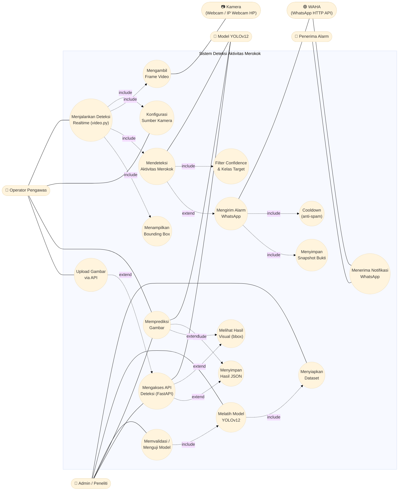

# Use Case Diagram — Sistem Deteksi Aktivitas Merokok

Versi Mermaid (bisa langsung di-render di VS Code / GitHub).
Lihat juga versi PlantUML di [use_case_diagram.puml](use_case_diagram.puml).

## Penjelasan Aktor

| Aktor | Peran |
|---|---|
| **Admin / Peneliti** | Menyiapkan dataset, melatih (`train.py`), dan menguji model. |
| **Operator Pengawas** | Menjalankan deteksi realtime (`video.py`), mengatur sumber kamera, melakukan upload gambar ke API. |
| **Penerima Alarm** | Pihak yang menerima pesan WhatsApp ketika sistem mendeteksi aktivitas merokok (mis. pengawas / orang tua). |
| **Kamera** *(sekunder)* | Sumber input video — webcam laptop, file video, atau IP Webcam HP. |
| **Model YOLOv12** *(sekunder)* | Mesin inferensi yang melakukan deteksi objek `merokok` & `pegang rokok`. |
| **WAHA** *(sekunder)* | WhatsApp HTTP API (Docker) yang meneruskan alarm ke nomor penerima. |

## Penjelasan Use Case Utama

- **Melatih Model YOLOv12** — pipeline training pada `train.py` memakai `data.yaml`.
- **Memprediksi Gambar** — inferensi batch via `predict.py`, output JSON & visual.
- **Mengakses API Deteksi** — endpoint FastAPI (`/predict`, `/predict/visual`) di `api.py`.
- **Menjalankan Deteksi Realtime** — `video.py` membaca stream kamera dan menjalankan inferensi per-frame.
- **Mendeteksi Aktivitas Merokok** — memfilter kelas target & ambang confidence (`ALERT_CONF_THRESHOLD`, `ALERT_CLASSES`).
- **Mengirim Alarm WhatsApp** — `alarm.py` mengirim pesan + snapshot bukti ke `WA_RECIPIENT` lewat WAHA, dengan **cooldown** (`ALERT_COOLDOWN_SEC`) untuk mencegah spam.
